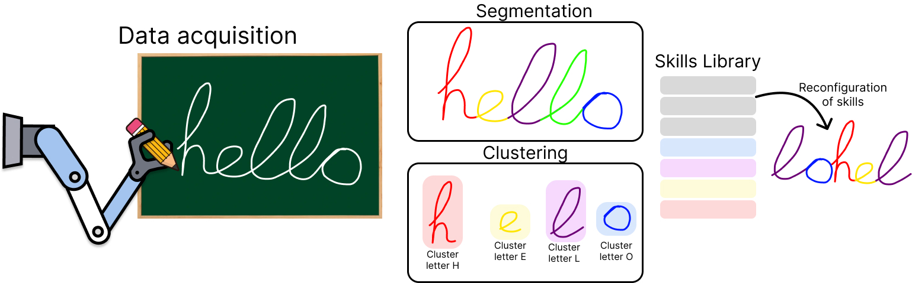
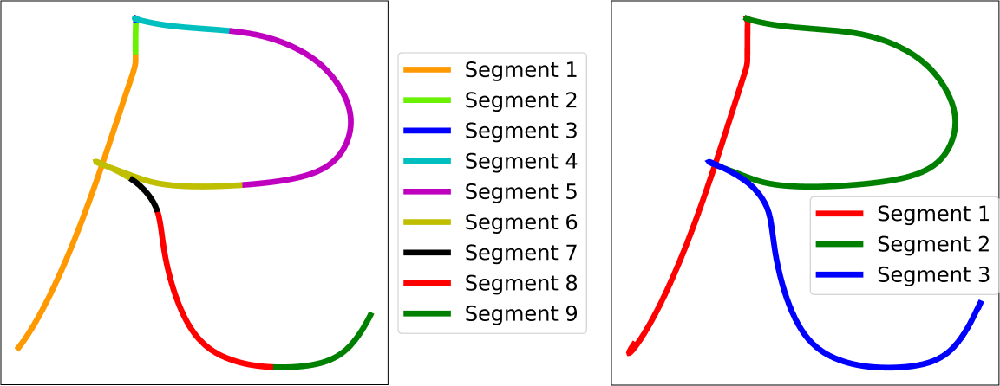

# **Learning of Movement Primitives by Gaussian Processes from Demonstrations**

<p align="center">
  
</p>
Motion primitives are a highly useful and widely employed tool in the field of Learning from Demonstration (LfD). However, obtaining a large number of motion primitives can be a tedious process, as they typically need to be generated individually for each task to be learned. To address this challenge, this work presents an algorithm for acquiring robotic skills through automatic and unsupervised segmentation. The algorithm divides tasks into simpler subtasks and generates motion primitive libraries that group common subtasks for use in subsequent learning processes. Our algorithm is based on an initial segmentation step using a heuristic method, followed by probabilistic clustering with Gaussian Mixture Models. Once the segments are obtained, they are grouped using Gaussian Optimal Transport on the Gaussian Processes (GPs) of each segment group, comparing their similarity through the energy cost of transforming one GP into another. This process requires no prior knowledge, is entirely autonomous, and supports multimodal information. The algorithm enables the generation of trajectories suitable for robotic tasks, establishing simple primitives that encapsulate the structure of the movements to be performed. Its effectiveness has been validated in manipulation tasks with a real robot, as well as through comparisons with state-of-the-art algorithms.

# Installation
To be used on your device, follow the installation steps below.
**Requierements:**
- There is a `requirements.txt` file with all the elements neccesary for the correct instalation.


## Install miniconda (highly-recommended)
It is highly recommended to install all the dependencies on a new virtual environment. For more information check the conda documentation for [installation](https://conda.io/projects/conda/en/latest/user-guide/install/index.html) and [environment management](https://conda.io/projects/conda/en/latest/user-guide/tasks/manage-environments.html). For creating the environment use the following commands on the terminal.

```bash
conda create -n SeGM python=3.11.2
conda activate SeGM
```

### Install repository
Clone the repository in your system.
```bash
git clone https://github.com/AdrianPrados/Segmentation-and-Grouping-Model.git
```
Then enter the directory and install all the requierements:
```bash
cd Segmentation-and-Grouping-Model
pip install -r requirements.txt
```

# **Algorithm execution**
The code is organized into two folders. The automatic segmentation process is contained in the folder [`SegmentationProb`](./SegmentationProb/), and the clustering process for the segments is located in the folder [`GOT`](./GOT/). The following explains the functionality of each algorithm and how to run them correctly:

## [SegmentationProb](./SegmentationProb/)
To perform the segmentation process, the algorithm relies on an initial heuristic approach followed by a probabilistic approximation. First, since heuristic methods tend to over-segment trajectories (left image), we use this approach to generate initial segments. The connection points of these segments are then used as initialization points for the Gaussian Mixture Model, which re-connect the segments based on their probabilistic weights across all segments (right image).

<p align="center">
  
</p>

To execute the segmentation process, go to the folder [`SegmentationProb`](./SegmentationProb/), then go to the folder [`scripts`](./SegmentationProb/scripts), and run the script [`ModSegment.py`](./SegmentationProb/scripts/ModSegment.py). This script will generate the segments and save them in the folder [`SegmentsFolder`](./SegmentationProb/scripts/SegmentsFolder/). The script need data to be run in 2D or 3D. In both modes, we use .h5 format data to be read. The data has to be in [`h5 files`](./SegmentationProb/h5%20files/). You can create easily 2D data using the script [`Data2D.py`](./SegmentationProb/scripts/drawData2D.py). You can chaneg between modes modifying the variable `mode` in the script [`ModSegment.py`](./SegmentationProb/scripts/ModSegment.py).

```python
mode = '2D' # 2D or 3D
```
## [Gaussian Optimal Transport (GOT)](./GOT/)
For the clustering process, the algorithm utilizes a similarity cost between the generated segments. A Gaussian Process is employed to establish the relationship between each segment. To evaluate the cost, a Gaussian Optimal Transport (GOT) process is used to assess the cost of transforming one segment into another. The lower the transformation cost, the more similar the segments are. Consequently, if the similarity exceeds a certain threshold, the segments are considered similar. A visual example is presented below, where the same color represents the same movement library.

<p align="center">
  
</p>

To execute the cluster process, go to the folder [`GOT`](./GOT/), and run the script [`main.py`](./GOT/main.py). This script will generate the clusters and save them in the folder [`GaussianPkl`](./GOT/GaussianPkl/). It is import to note that you need to have the segments generated in the previous step.


### **Experiments with robot manipulator**
To test the efficiency of the algorithm, experiments have been carried out with a manipulator in a real environment. For this purpose, a series of data have been taken by means of a kinesthetic demonstration and then tested re-organizing the movement primitvies generated with our method. 

<p align="center">
  
</p>

The video with the solution is provided on [Youtube](https://youtu.be/A3m2sbUI5F0)

# Citation
If you use this code, please quote our works :blush:

In progress :construction_worker:

## Acknowledgement
This work was supported by Advanced Mobile dual-arm manipulator for Elderly People Attendance (AMME) (PID2022-139227OB-I00), funded by Ministerio de Ciencia e Innovacion.

This work has been developed in the [Mobile Robotics Group](https://github.com/Mobile-Robots-Group-UC3M) from RoboticsLab, at University Carlos III de Madrid.